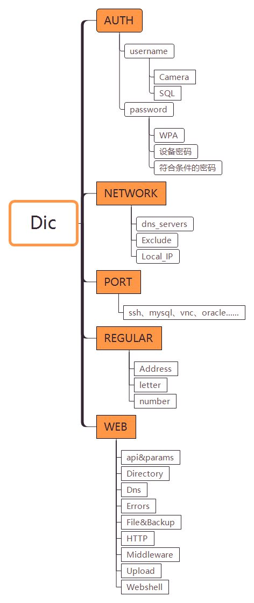

# README

---

# Directory structure



---

# password rule

常见组合 (Common)
- `payload` + 123
- `payload` + 1234
- `payload` + 123456
- `payload` + 12345
- `payload` + @123
- `payload` + @123456
- `payload` + @12345
- `payload` + #123
- `payload` + #123456
- `payload` + #12345
- `payload` + _123
- `payload` + _123456
- `payload` + _12345
- `payload` + 123!@#
- `payload` + !@#$
- `payload` + !@#
- `payload` + ~!@
- `payload` + !@#123
- `payload` + 2017
- `payload` + 2016
- `payload` + 2015
- `payload` + @2017
- `payload` + @2016
- `payload` + @2015

生日组合 (Birthday)
- 19880808
- tony19980808
- tony@19980808

年份列表 (years)
- 1987
- 1988
- 1989

1337模式替换 (leet)
- 1earn

键盘布局 (Keyboard layout)
- qwerty

大小写变换 (case reversal)
- admin
- Admin
- admIn

姓名全拼
- zhangsan

姓名带点
- jing.zhang

单位名+`@`+`年份/123/或常见弱口令` (company + sth.)
- Huawei@123

单位名+小写业务名+`@`+`年份/123/或常见弱口令` (company + business + sth.)
- BEIJINGXXyy@2019

大写地名+小写业务名+`@`+`年份/123/或常见弱口令` (Place + business + sth.)
- BEIJINGinfo@2019

大写城市+小写区县+单位名 (Uppercase city + lowercase district/county + unit name + sth.)
- BJ_cy_yey(北京_朝阳_幼儿园)

管理员名+`@`+`年份/123/或常见弱口令` (Administrator + sth.)
- tony@2019

工号 (staff ID)
- 0000-9999

公司相关信息 域名+简称 (Company Information Domain+Abbreviation)
- wy@360buy
- xxx.com@123
- 企业缩写@2021

---

# Common SQL

**SQL 查询重复出现次数最多的记录,按出现频率排序 (The records with the highest number of queries, sorted by frequency.)**
```sql
SELECT keyword, count( * ) AS count
FROM article_keyword
GROUP BY keyword
ORDER BY count DESC
LIMIT 20
```

**查询不重复的记录 (Searching for non-duplicate records)**
```sql
select distinct * from tableName
```

**查询不重复的记录转入其他表 (Transferring non-duplicate queries to other tables)**

- 转移到新表 (Transfer to new table)
    ```sql
    create table tab2 as select distinct * from tab1
    ```

- 转移到存在的表 (Transfer to the exist table)
    ```sql
    insert into tab2 select distinct * from tab1
    ```

**查询A表有但B表没有的数据 (Queries the data that exist in Table A but not in Table B.)**
```sql
select a.name
from tab1 a left join tab2 b
on a.name = b.name
where b.name is null
```

**不应该出现在web目录字典的字符 (Characters that should not appear in the web directory dictionary)**
```sql
!
@
#
$
%
^
&
*
(
)
--
=
>
<
;
:
"
'
,
?
½
|
{
}
+
//
/_
_/
__
_.
/\
2001
2002
2003
2004
2005
2006
2007
2008
2009
2010
2011
2012
2013
2014
2015
2016
空格
/1/
/2/
/3/
/4/
/5/
/6/
/7/
/8/
/9/
¿
±
¼
°
÷
»
..
./
\
```

**查询库中脏数据**
```sql
SELECT * FROM `tab1` where text like '%\!%'
or text like '%\@%'
or text like '%\#%'
or text like '%\$%'
or text like '%\%%'
or text like '%\^%'
or text like '%\&%'
or text like '%\*%'
or text like '%\(%'
or text like '%\)%'
or text like '%\-\-%'
or text like '%\=%'
or text like '%\>%'
or text like '%\<%'
or text like '%\;%'
or text like '%\:%'
or text like '%\"%'
or text like '%\'%'
or text like '%\,%'
or text like '%\?%'
or text like '%\½%'
or text like '%\|%'
or text like '%\}%'
or text like '%\{%'
or text like '%\+%'
or text like '%\/\/%'
or text like '%\/\_%'
or text like '%\_\/%'
or text like '%\_\_%'
or text like '%\_\.%'
or text like '%\/\\%'
or text like '%2001%'
or text like '%2002%'
or text like '%2003%'
or text like '%2004%'
or text like '%2005%'
or text like '%2006%'
or text like '%2007%'
or text like '%2008%'
or text like '%2009%'
or text like '%2010%'
or text like '%2011%'
or text like '%2012%'
or text like '%2013%'
or text like '%2014%'
or text like '%2015%'
or text like '%2016%'
or text like '% %'
or text like '%\/1\/%'
or text like '%\/2\/%'
or text like '%\/3\/%'
or text like '%\/4\/%'
or text like '%\/5\/%'
or text like '%\/6\/%'
or text like '%\/7\/%'
or text like '%\/8\/%'
or text like '%\/9\/%'
or text like '%\¿%'
or text like '%\±%'
or text like '%\¼%'
or text like '%\°%'
or text like '%\÷%'
or text like '%\»%'
or text like '%\.\.%'
or text like '%\.\/%'
or text like '%\\%'
```

**容易误伤的匹配**
```sql
or text like '%\-%'
or text like '%asked%'
or text like '%chufang%'
or text like '%chongzhi%'
or text like '%caiji%'
or text like '%bianji%'
or text like '%qingdao%'
or text like '%qqshopadmin%'
or text like '%ubb%'
or text like '%b2b%'
or text like '%cj\_%'
or text like '%ty\_%'
or text like '%p\-h%'
or text like '%ea\_c%'
or text like '%ds\_p%'
or text like '%in\_t%'
or text like '%min\_%'
or text like '%bs\_%'
or text like '%nf\_%'
or text like '%project\_2%'
or text like '%qzfyfs\_admin%'
or text like '%qwbm\_bookinc%'
or text like '%outward\_edit%'
or text like '%scs\_%'
or text like '%sdcms\_%'
or text like '%Fy\_Sql%'
or text like '%Gehang%'
or text like '%Guowai%'
or text like '%Gongye%'
or text like '%Keji%'
or text like '%Zuqiu%'
or text like '%Zixun%'
or text like '%amd\_007%'
or text like '%ewindowe%'
or text like '%jkxh%'
or text like '%xqfh%'
or text like '%lsjq%'
or text like '%zsbs%'
or text like '\/\.%'
or text like '%\/a\_%'
or text like '%\/b\_%'
or text like '%\/c\_%'
or text like '%\/m\_%'
or text like '%\/en\/%'
or text like '%\/zh\/%'
or text like '%\/excel2%'
or text like '%\/apsnetxml\/apsnetxml\/%'
or text like '%xinzhang%'
or text like '%xiaoshuo%'
or text like '%xmlbbs%'
or text like '%projectbbs%'
or text like '%zaoxue%'
or text like '%zhangkuan%'
or text like '%buymanage%'
or text like '%ztb\_bd\_%'
or text like '%admin\-%'
or text like '%deepsoo%'
or text like '%btoo\_%'
or text like '%forum\_%'
or text like '%gl\_%'
or text like '%global\_%'
or text like '%uyhut%'
or text like '%v3basic%'
or text like '%cdqh%'
or text like '%help\/help%'
or text like '%\/adminv612%'
or text like '%\/agent\/agent\/%'
or text like '%baobiao%'
or text like '%zxjwan%'
or text like '%xz\_%'
or text like '%dd\_%'
or text like '%\/alimnadmin%'
or text like '%\/cms\/cms%'
or text like '%headhunt%'
or text like '%wjgl%'
or text like '%\/jie%'
or text like '%job\_%'
or text like '%guangbo%'
or text like '%c000%'
or text like '%s000%'
or text like '%\/tpc00%'
or text like '%fckeditor1\_2%'
or text like '%jiao\_liu%'
or text like '%mbf\_user%'
or text like '%module\_article%'
or text like '%jizhang%'
or text like '%\/app_d\/%'
or text like '%visualtemplate%'
or text like '%\/membership\-%'
or text like '%第八天%'
or text like '%3\.5%'
or text like '%\/\.kins\/%'
or text like '%\/yonghua%'
or text like '%\/xuegong%'
or text like '%\/xjufida\_%'
or text like '%\/xiaoshou\_%'
or text like '%\/xhsqw_51%'
or text like '%\/wilsonwebformdemo%'
or text like '%\/website%'
or text like '%\/webform%'
or text like '%\/teach\_%'
or text like '%\/desktopmodules%'
or text like '%\/oaand%'
or text like '%\/membermanage%'
or text like '%z9v8%'
or text like '%\/manage\_%'
or text like '%\/loginstudent%'
or text like '%\/loginteacher%'
or text like '%\/iissamples%'
or text like '%\/safecode%'
or text like '%\/fesend%'
or text like '%\/english%'
or text like '%\_com%'
or text like '%accessories%'
or text like '%cx\_a%'
or text like '%app\_%'
or text like '%btoo\_%'
or text like '%xdrag\_ui%'
or text like '%wz\_%'
or text like '%xymanage%'
or text like '%yfhandler%'
or text like '%yxshop\.web%'
or text like '%zdymodel%'
or text like '%zdytag%'
or text like '%accessories%'
or text like '%ad\_%'
or text like '%\/bbs\/%'
or text like '%astreeiewdemo%'
or text like '%\/book\/%'
or text like '%\/chargemanage\/%'
or text like '%clientdependency\.web\.test%'
or text like '%\/clientmanage%'
or text like '%\/dengru%'
or text like '%\/dh\_%'
or text like '%company\_%'
or text like '%\/dotnettextboxwebsite%'
or text like '%\/cuteeditor%'
or text like '%\/hotelmanager%'
or text like '%\/dboperatorserice%'
or text like '%grid\_%'
or text like '%jiayi9%'
or text like '%057%'
or text like '%was5%'
or text like '%xiaoyuan%'
or text like '%tabbedpanel%'
or text like '%dianshi%'
or text like '%digshell%'
or text like '%dvbbs%'
or text like '%\/hl\/%'
or text like '%\/lyb\/%'
or text like '%fangchan%'
or text like '%pages2%'
or text like '%ylmf%'
or text like '%\_1%'
or text like '%\_2%'
or text like '%\_0%'
or text like '%\_3%'
or text like '%\_4%'
or text like '%\_5%'
or text like '%\_6%'
or text like '%\_7%'
or text like '%\_8%'
or text like '%\_9%'
or text like '%\/yq_%'
or text like '%\/zw_%'
or text like '%zuitu%'
or text like '%zwmobi%'
or text like '%zuitubiz%'
or text like '%\/z\_d%'
or text like '%\/Yz\_Plug%'
or text like '%\/yz\_qq%'
```

---

# Combine and re-duplicates

```bash
cat file1.txt file2.txt fileN.txt > out.txt
sort out.txt | uniq > out2.txt
```

---

# Recommended tools

- [PilotEdit](https://www.pilotedit.com/) - 大文件编辑器 (Large file editor)
- [glogg](https://glogg.bonnefon.org/download.html) - 大文件查看工具(只读) (Large file viewing tool (read only))
